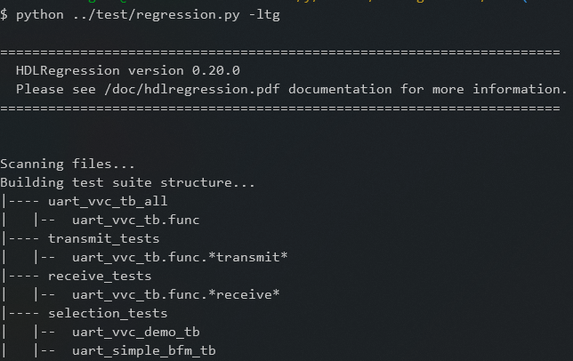

#######################################################################################################################
Command Line Interface (CLI)
#######################################################################################################################

| The configuration of a regression run can be set directly from the command line using command line interface. 
  This can be useful when debugging the behaviour of a design, e.g. by running in :doc:`GUI mode <gui>`, 
  or working with a :ref:`testcase <Testcase>` or :ref:`test group <Test group>`. 
| The command line interface are processed at startup and will override any scripted configurations that are in conflict.

+-------------------------------------+----------------------------------------------+--------------------------------------------+
| Arguments                                                                          | Description                                |
+=====================================+==============================================+============================================+
|     -h                              |    --help                                    | Help screen                                |
+-------------------------------------+----------------------------------------------+--------------------------------------------+
|     -v                              |    --verbose                                 | Enable full verbosity                      |
+-------------------------------------+----------------------------------------------+--------------------------------------------+
|     -d                              |    --debug                                   | Enable debug mode                          |
+-------------------------------------+----------------------------------------------+--------------------------------------------+
|     -g                              |    --gui                                     | Run with simulator gui                     |
+-------------------------------------+----------------------------------------------+--------------------------------------------+
|     -fr                             |    --fullRegression                          | Run all tests                              |
+-------------------------------------+----------------------------------------------+--------------------------------------------+
|     -c                              |    --clean                                   | Remove all before test run                 |
+-------------------------------------+----------------------------------------------+--------------------------------------------+
|     -tc TB_ENTITY [TB_ARCH [TC]]    |    --testCase TB_ENTITY [TB_ARCH [TC]]       | Run selected testcase                      |
+-------------------------------------+----------------------------------------------+--------------------------------------------+
|     -tg TESTGROUP                   |    --testGroup TESTGROUP                     | Run selected test group                    |
+-------------------------------------+----------------------------------------------+--------------------------------------------+
|     -ltc                            |    --listTestcase                            | List all discovered testcases              |
+-------------------------------------+----------------------------------------------+--------------------------------------------+
|     -ltg                            |    --listTestgroup                           | List all test groups                       |
+-------------------------------------+----------------------------------------------+--------------------------------------------+
|     -lco                            |    --listCompileOrder                        | List libraries and files in compile order  |
+-------------------------------------+----------------------------------------------+--------------------------------------------+
|     -fc                             |    --forceCompile                            | Force recompile                            |
+-------------------------------------+----------------------------------------------+--------------------------------------------+
|     -sof                            |    --stopOnFailure                           | Stop simulations on testcase fail          |
+-------------------------------------+----------------------------------------------+--------------------------------------------+
|     -s                              |    --simulator                               | Set simulator (require path in env)        |
+-------------------------------------+----------------------------------------------+--------------------------------------------+
|     -t                              |    --threading [N]                           | Run tasks in parallel                      |
+-------------------------------------+----------------------------------------------+--------------------------------------------+
|     -ns                             |    --no_sim                                  | No simulation, compile only                |
+-------------------------------------+----------------------------------------------+--------------------------------------------+
|                                     |    --showWarnError                           | Show sim error and warning messages.       |
+-------------------------------------+----------------------------------------------+--------------------------------------------+
|                                     |    --noColor                                 | Disable terminal output colors.            |
+-------------------------------------+----------------------------------------------+--------------------------------------------+
|                                     |    --waveFormat                              | Wave file format [VCD (default) or FST]    |
+-------------------------------------+----------------------------------------------+--------------------------------------------+
|                                     |    --wlf                                     | Save wlf file after sim (Questa/Modelsim)  |
+-------------------------------------+----------------------------------------------+--------------------------------------------+

***********************************************************************************************************************	     
Examples
***********************************************************************************************************************	     

Full regression
=======================================================================================================================

Enabling the :ref:`full regression mode <What is regression testing>` ensures that all testcases are run, regardless
of any previous runs, i.e. re-running the complete test suite.

.. code-block:: console

  > python ../test/regression.py -fr

  

Testcases
=======================================================================================================================

All tests that are discovered by HDLRegression can be listed using the ``-ltc`` or ``--listTestcase`` argument, and 
are listed as ``<testbench entity>.<testbench architecture>.<sequencer built-in testcase>`` or just 
``<testbench entity>.<testbench architecture>`` if no sequencer built-in testcases are used.

.. code-block:: console

  > python ../test/regression.py -ltc
		

Running a selected test is done using the ``-tc <testbench.architecture.testcase>`` or 
``--testCase <testbench.architecture.testcase>`` argument

.. include:: wildcards_reference_tip.rst
  
.. code-block:: console

  > python ../test/regression.py -tc uart_vvc_tb.func.check_simple_receive

A testcase can also be selected using the testcase number from the ``-ltc`` or ``--listTestcase`` argument

.. code-block:: console

  > python ../test/regression.py -tc 5

.. image:: images/testcase_running.png
  :width: 750
  :name: running in terminal
  :align:   center

.. tip::
  Testcases are identified by:

  #. <entity_name>
  #. <entity_name>.<architecture_name>
  #. <entity_name>.<architecture_name>.<sequencer_testcase>

  | When selecting testcases to run, you can utilize wildcards to simplify the process. However, it's important to
    note that the test case identifier must follow a specific naming convention.
  | For example, if you want to run all sequencer testcases that contain the word "write," you would need to specify
    the identifier as <entity_name>.<architecture_name>.write.
  | Note that you can also use wildcards for <entity_name> and/or <architecture_name> to further
    refine your filter.

Test groups
=======================================================================================================================

Listing of test groups that have been defined in the regression script. In the code snippet below there are defined
two test groups, `transmit_tests` and `receive_tests`, that will run all testcases that have `transmit` and `receive`
in the testcase name, and is defined in testbench `uart_vvc_tb` architecture `func`. 
There is also a test group `selection_tests` that will run all testcases that are part of the `uart_vvc_demo_tb` and 
`uart_simple_bfm_tb` entities.

Defining test groups
-----------------------------------------------------------------------------------------------------------------------

.. code-block:: python

    hr.add_to_testgroup('transmit_tests', 'uart_vvc_tb', 'func', '*transmit*') # run all transmit related tests
    hr.add_to_testgroup('receive_tests', 'uart_vvc_tb', 'func', '*receive*')   # run all receive related tests
    hr.add_to_testgroup('selection_tests', entity='uart_vvc_demo_tb')          # run this testbench
    hr.add_to_testgroup('selection_tests', entity='uart_simple_bfm_tb')        # run this testbench

.. include:: wildcards_reference_tip.rst

Listing test groups
-----------------------------------------------------------------------------------------------------------------------

.. code-block:: console

  > python ../test/regression.py -ltg

Running test groups
-----------------------------------------------------------------------------------------------------------------------

Running one of the test groups, e.g. `receive_tests`, will run all tests with names that matches:

* testbench entity with ``uart_vvc_tb``
* testbench architecture with ``func``
* sequencer built-in testcase with ``receive``

.. code-block:: console

  > python ../test/regression.py --testGroup receive_tests

.. Image:: images/testgroup_running.png
  :width: 750
  :name: running test group
  :align: center
  

***********************************************************************************************************************	     
Threading
***********************************************************************************************************************	     

HDLRegression will run all tasks (pre-processing and testcase simulations) in a sequential order, but this can be changed
using the ``-t`` / ``--threading`` option, and optioinally with a number of threads.

.. note::

   * Running simulations in parallel using ``N`` threads may require ``N`` simulator licenses.
   * Pre-processing threads are scaled to:
      -> the number of libraries

      -> the number of files in each library

      -> the number of parsers

Sequential
=======================================================================================================================

All pre-processing steps and testcase running are performed sequentially.

.. code-block:: console

  > python ../test/regression.py -tg receive_tests

.. Image:: images/testgroup_running.png
  :width: 750
  :name: running test group sequentially
  :align: center

Pre-processing in parallel, simulations sequentially
=======================================================================================================================

All pre-processing steps are performed in parallel and testcase running is performed sequentially.

.. code-block:: console

  > python ../test/regression.py -tg receive_tests -t

.. Image:: images/testgroup_threading_1.png
  :width: 750
  :name: running test group threading 1
  :align: center

Pre-processing and simulations in parallel using 10 threads
=======================================================================================================================

All pre-processing steps and testcase running is performed in parallel.

.. code-block:: console

  > python ../test/regression.py -tg receive_tests -t 10

.. Image:: images/testgroup_threading_10.png
  :width: 750
  :name: running test group threading 10
  :align: center

***********************************************************************************************************************	     
Simulation results
***********************************************************************************************************************	     

Running simulations in terminal will output the necessary information, such as the testcase name, generics used,
simulation run time and result.

Regression initial run
=======================================================================================================================

.. image:: images/regression_run_1.png
  :width: 750
  :name: initial regression run all tests
  :align:   center

Regression run without changes
=======================================================================================================================

No tests are run when no changes are detected in the DUT or testcase files, unless full regression is enabled using
the :doc:`cli` ``-fr`` or using the :doc:`api` in the regression script ``hr.start(full_regression=True)``.

Failing testcase run
=======================================================================================================================

A failing testcase will be reported as **FAIL** with a short summary from the test log:

.. image:: images/failing_testcase.png
  :width: 1000
  :name: failing testcase
  :align:   center
