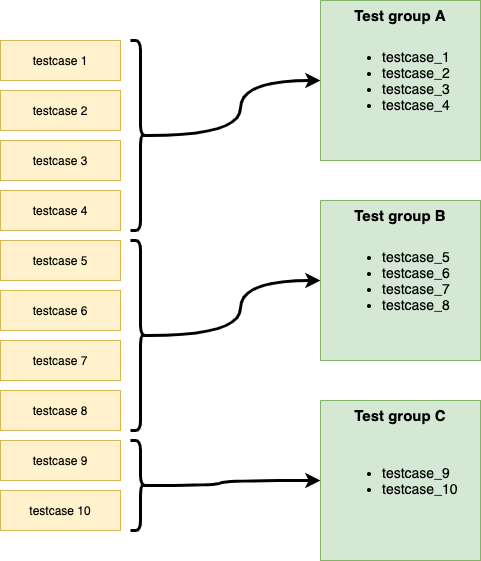

***********************************************************************************************************************	     
Introduction
***********************************************************************************************************************	     

What is HDLRegression
=======================================================================================================================

.. include:: description.rst

For an existing project to start using HDLRegression there are only two tasks that have to be carried out

* 1 - add a code comment to the top level testbench entity
* 2 - make a test script where libraries and files are specified.

HDLRegression is shipped with basic and advanced test script :doc:`templates` files that have guidelines instructions that help the 
test designer in getting started in setting up a complete and ready to use HDLRegression test script.
The basic template file show the only code that is required to run HDLRegression, where all that is needed is to add file(s) 
and potentially a compile library. 

HDLRegression is distributed as open source and can be downloaded from `GitHub <https://github.com/UVVM>`_.

.. note::
  HDLRegression is not a verification framework but a tool for running testbenches that verifies the design behaviour.

  This allows you to choose any verification framework, e.g. company internal developed, UVVM, OSVVM, VUnit and so on.
  
  a) Without making any changes to the verification files other than adding a single code comment in the testbench. 
  b) Without the need for regression dedicated VHDL code from other frameworks - use whichever you prefer.
  c) With a verification framework independent regression suite.

.. _regression-testing:

What is regression testing
=======================================================================================================================

Regression testing is re-running functional and non-functional tests to ensure that previously developed and 
tested software still performs after a change. (`wikipedia <https://en.wikipedia.org/wiki/Regression_testing>`_)

Terminology
=======================================================================================================================

Testbench
------------------------------------------------------------------------------------------------------------------------

A testbench is the top level entity and architecture which is used as input to the simulations. 
Verification of a DUT (device under test) may require one or more testbenches. The testbench will 
consist of:

* A test sequencer.
* A test-harness - not required, but recommended.
* Optionally other support modules, procedures or statements outside the test-harness.

Different configurations of a testbench using different DUT architectures are considered as the same 
testbench, running on different DUT representations.
Different configurations of a testbench using different test-harness architectures are considered as 
different testbenches, as testbench behaviour may be different.

Test sequencer
------------------------------------------------------------------------------------------------------------------------

The test sequencer is a single VHDL process controlling the simulations from start to end, and may sometimes 
be called the "central (test) sequencer".

Test-harness
------------------------------------------------------------------------------------------------------------------------

The test-harness consist of a VHDL entity containing the fixed parts of the verification environment - often shared 
between various testbenches. E.g. DUT and verification support such as verification components or processes, 
including concurrent procedures.

Test suite
------------------------------------------------------------------------------------------------------------------------

A test suite is the complete set of testbenches required for a given DUT, or for a complete FPGA including modules.

Testcase
------------------------------------------------------------------------------------------------------------------------

A testcase is

* A scenario or sequence of actions that are controlled by the test sequencer.
* May test one or multiple features/requirements.
* Typically testing of related functionality, or a logical sequence of events, or an efficient sequence 
  of events.
* The minimum sequence of events possible to run in a single simulation execution. Thus, if there is an option to 
  run of multiple test sequences (A, B or C), a set of test sequences (A and B) or all sequences (A+B+C), then all 
  of A, B and C are defined as individual testcases.

Test group
------------------------------------------------------------------------------------------------------------------------

A test group is a collection of testcases that typically verifies the same modules or features of a DUT.
There are several ways of structuring testbenches and testcases, and HDLRegression support many of these.

A test group can be:

  - A single testbench or a collection of testbenches
  - A single testcase or a collection of testcases

Typically a test group contains testbenches and/or testcases that verifies a set of features or functionality, 
e.g. error injection, interface functionality or any other sub-set of DUT functionality.

	     
***********************************************************************************************************************	     
Usage
***********************************************************************************************************************	     

HDLRegression is configured using a Python 3 script that imports the HDLRegression module which is used for creating a HDLRegression
object which is used to customize the regression run using a set of :doc:`api` commands.

When HDLRegression is run it will perform several tasks in the background, and if any of the files added is a `testbench`_ file, 
i.e. with the ``--HDLREGRESSION:TB`` *(VHDL)* or ``//HDLREGRESSION:TB`` *(Verilog)* pragma set, HDLRegression will:

  - Organize files and libraries by dependencies
  - Scan for defined testcases in the testbench (a testcase generic is required for this feature)
  - Compile to the default or a specified library
  - Run all testbenches
  - Report simulation results to terminal

***********************************************************************************************************************	     
Installation
***********************************************************************************************************************	     

For the regression script to be able to use the HDLRegression package module,
one has to do one of the following steps:

* Install HDLRegression using the `setup.py`_ script.
* Add the HDLRegression install path to `Python PATH`_ inside the regression script.

.. _setup.py:

Setup script
=======================================================================================================================

There is a setup.py script in the HDLRegression root folder that can be used for installing HDLRegression as a 
Python package, and installing HDLRegression will make it importable without adding it to the Python PATH.
We recommend that HDLRegression is installed as a Python package as this will make the regression script more
portable and easy to write. 
Execute the two following commands to install HDLRegression as package:

1. Build the package

.. code-block:: console

  python3 setup.py build

2. Install the HDLRegression package

.. code-block:: console

  python3 setup.py develop

HDLRegression can be imported directly in the regression script as any standard Python module

.. code-block:: python

  from hdlregression import HDLRegression

Uninstall
------------------------------------------------------------------------------------------------------------------------

Uninstalling can be done with the commands:

.. code-block:: console

  python3 setup.py develop --uninstall

Python PATH
=======================================================================================================================

The HDLRegression module can be used without package installation by adding the HDLRegression install path to the 
Python PATH variable at the beginning of the regression script:

.. code-block:: python

  import sys
  sys.path.append(<path_to_hdlregression_folder>)

  from hdlregression import HDLRegression

.. note::
  
  HDLRegression will have to be added to the Python PATH in every regression script which will make
  the regression script less portable.

.. include:: file_reference_note.rst
